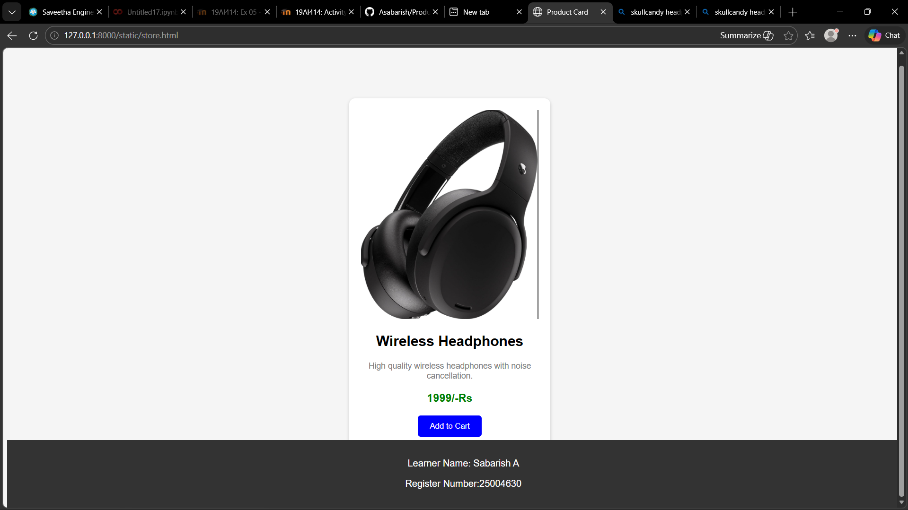

# Product Card Design with Hover Effect using CSS
## Date:9.3.2026

## AIM:
To design a Product Card for an E-commerce website using HTML and CSS and apply hover effects, transitions, and styling techniques to create an interactive user interface.

## DESIGN STEPS:

### Step 1:
Create a basic HTML structure using ```<!DOCTYPE html>, <html>, <head>, and <body>```.

### Step 2:
Add a container div for the product card.

### Step 3:
Insert the product image using the `````` tag.

### Step 4:
Add product name, description, and price using ```<h3>``` and ```<p>``` tags.

### Step 5:
Create an Add to Cart button using the ```<button>``` tag.

### Step 6:
Style the product card using CSS by applying:
<ul>
  <li>width</li>
  <li>padding</li>
  <li>border-radius</li>
  <li>box-shadow</li>
</ul>

### Step 7:
Align the card content using text-align and spacing properties.

### Step 8:
Add hover effects using :hover selector.

### Step 9:
Apply transform: translateY() to move the card slightly upward on hover.

### Step 10:
Increase the box-shadow to create a lifting effect.

### Step 11:
Add transform: scale() to slightly zoom the product image on hover.

### Step 12:
Apply transition property to make the hover animation smooth.

### Step 13:
Create a footer section at the bottom of the page.

### Step 14:
Display Learner Name and Register Number inside the footer.

### Step 15:
Style the footer using background color and center alignment.

### Step 10:
Test your webpage in a browser.

## PROGRAM:
```
store.html
<!DOCTYPE html>
<html>
<head>
    <title>Product Card</title>
    <link rel="stylesheet" href="style.css">
</head>

<body>

<div class="card">

    

    <h2>Wireless Headphones</h2>

    <p class="desc">
        High quality wireless headphones with noise cancellation.
    </p>

    <h3 class="price">1999/-Rs</h3>

    <button>Add to Cart</button>

</div>

<footer>
    <p>Learner Name: Sabarish A</p>
    <p>Register Number:25004630</p>
</footer>

</body>
</html>


style.css

body{
    font-family: Arial;
    background-color:#f5f5f5;
    text-align:center;
}
.card{
    width:300px;
    background:white;
    border-radius:10px;
    padding:20px;
    margin:100px auto;
    box-shadow:0 2px 5px rgba(0,0,0,0.2);
    transition:0.3s;
}

.product-img{
    width:100%;
    transition:0.3s;
}

.desc{
    font-size:14px;
    color:gray;
}

.price{
    color:green;
}

button{
    padding:10px 20px;
    background-color:blue;
    color:white;
    border:none;
    border-radius:5px;
    cursor:pointer;
    transition:0.3s;
}
.card:hover{
    transform:translateY(-10px);
    box-shadow:0 10px 20px rgba(0,0,0,0.3);
}

.card:hover .product-img{
    transform:scale(1.1);
}

.card:hover button{
    background-color:red;
}
footer{
    background-color:#333;
    color:white;
    padding:15px;
    text-align:center;
    position:fixed;
    bottom:0;
    width:100%;
}


```
## OUTPUT:

## RESULT:
The Product Card with Hover Effect was successfully designed using HTML and CSS.
